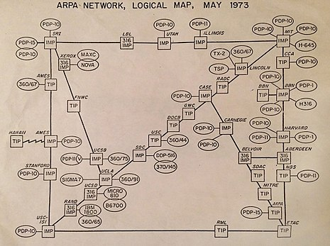
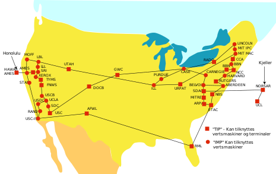

## Background
"Cloud computing is the on-demand availability of computer system resources \[such as\] data storage and computing power, without direct active management by the user. \[Cloud computing\] relies on a "pay-as-you-go" model ..."\[[Wikipedia](https://en.wikipedia.org/wiki/Cloud_computing)\].

That means we can **rent** computing resources whenever we need them, as many as we need, and pay only for as long as we use them. All we need is access to the Internet and a credit card to start using the Cloud.

    
 
<b>Cloud computing offerings: Infrastructe, Platform, Software, .. as a Service (IaaS, PaaS, SaaS, DaaS).</b>

Renting the computing resources we need (as opposed to buying and setting them up, which is a costly and complex undertaking), enables us to concentrate in our project, whether it is:
- running some research experiments
- developing a proof of concept for a new product or
- running a course like this one, where we are providing each student with a virtual machine (PaaS) with all the necessary data and software analysis tools ready to use --- deleting the virtual machines once the course is over.

**Two notes on terminology**: 

Communication-wise, the **Cloud** refers to the Internet and all attached computers and devices, as shown in these figures:

    &nbsp;&nbsp;&nbsp;
      

<b>The Cloud today : &nbsp;the Internet, the Internet of Things (IoT) and the Industrial IoT (IIoT).</b>

The term **Cloud** comes from trying to simplify the representation of the Internet in diagrams by representing it as a cloud. 

    &nbsp;&nbsp;&nbsp;&nbsp;&nbsp;&nbsp;&nbsp;&nbsp;&nbsp;
      

<b>Representation of Arpanet in 1973, the predecessor of the Internet. As more sites and countries were connected to the Internet, depicting all interconnections became impractical, and a cloud was used instead to represent all interconnections.</b>

## Working in the Cloud/with Remote Machines

There are a number of reasons why accessing a remote machine is valuable to scientists working with large datasets. Many analyses (especially in 'omics) are too large to run on our laptops or desktops. These analyses require larger machines, often several machines linked together, and remote access to these machines is the only practical solution.  

Cloud computing simplifies the use of as many computing resources as you need, at relatively low cost thanks to the various offerings available. You just need to define your computational requirements and off you go.

### When should I use the cloud?

You'll know you need to start working on the cloud when:

- Your computer does not have enough resources to run the desired analysis (memory, processors, disk space, network bandwidth).
- Your computer is taking hours or days to get through an analysis.
- It is not possible to install the software needed on your computer (no version for your operating system, conflicts with other existing applications, etc.)
- You cannot afford the infrastructure (hardware, bandwidth, power supply, administrator) required to acquire and maintain sufficiently large computers for your analysis.
- You need to continue working on your analyses while you travel.

The cloud is a part of our everyday life (e.g. using Amazon, Google, Netflix, or an ATM involves remote computing). 

### Choosing a cloud platform

The most important thing about the **cloud** is choice - instead of purchasing a physical computer, you can obtain on-demand computing at almost any scale. This power comes with advantages and disadvantages:

**Advantages of Cloud Computing**

* Access large amounts of computing power on demand
* Full administrative rights - install anything
* Use pre-configured "images" (virtual machine snapshots where operating system and software are already installed)
* Your local operating system doesn't matter - once you connect to the cloud you can run any UNIX software

**Disadvantages of Cloud Computing**

* It takes time to upload data and download results
* Cloud computing costs money (you must keep track of your costs)
* If you need help, you may not have a local system administrator
* Some resources may be poorly documented, for example: you may not be clear what is installed in a virtual machine or how to use it
* Form of payment (credit card)*
* Understanding of Amazon's billing and payment (See: [Getting started with AWS Billing and Cost Management](https://docs.aws.amazon.com/awsaccountbilling/latest/aboutv2/billing-getting-started.html))

\* You can use some of cloud services **for free** for one year with Amazon Web Services (AWS), Microsoft Azure, and Google Cloud.  There are also AWS Cloud Credits for Research (See: [https://aws.amazon.com/research-credits/](https://aws.amazon.com/research-credits/) ). The free level of service *will not* be sufficient for working with the amount of data we are using for our lessons.

### Cloud platform choices

There are several cloud providers to choose from. Some scientific clouds may either be free or allocate resources competitively. Commercial clouds can be very powerful, but choice can be overwhelming. At the end of 2020, the cloud market share was AWS 33%, Microsoft Azure 19%, Google Cloud 7%, Alibaba Cloud 6%, others 35%.

Learn more about cloud computing in bioinformatics 
Fusaro, V. A., Patil, P., Gafni, E., Wall, D. P., & Tonellato, P. J. (2011). Biomedical cloud computing with Amazon Web Services. PLoS Computational Biology, 7(8), e1002147. https://doi.org/10.1371/journal.pcbi.1002147

Navale, V., & Bourne, P. E. (2018). Cloud computing applications for biomedical science: A perspective. PLoS Computational Biology, 14(6), e1006144. https://doi.org/10.1371/journal.pcbi.1006144
